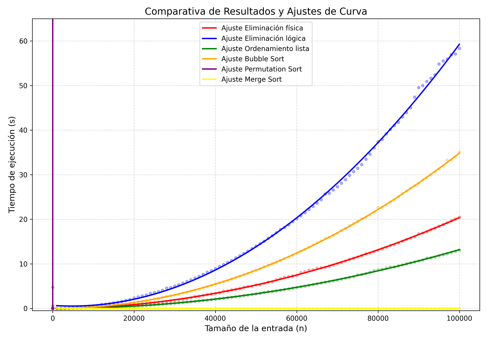

# Comparativa de Algoritmos de Ordenamiento

Este repositorio contiene un estudio experimental realizado para la materia de **Análisis y Diseño de Algoritmos**, donde se evalúa el rendimiento de diversos algoritmos de ordenamiento numérico.

## Introducción

El objetivo de esta actividad es comparar la eficiencia temporal de distintos algoritmos bajo condiciones controladas. Se analizaron métodos que van desde complejidades cuadráticas hasta logarítmicas y exponenciales.

**Algoritmos analizados:**
* Eliminación física.
* Eliminación lógica.
* Ordenación en una sola lista (Selection Sort).
* Bubble Sort (Ordenamiento burbuja).
* Permutation Sort (Bogosort).
* Merge Sort (Ordenamiento por mezcla).

### Metodología
Para cada algoritmo se realizaron **30 experimentos**. Para determinar el tiempo de ejecución final, se utilizó un **promedio truncado** (eliminando el mejor y el peor caso), permitiendo obtener resultados más estables frente a variaciones del sistema.

### Entorno de Pruebas
Las pruebas se ejecutaron en un equipo con las siguientes especificaciones técnicas:
* **RAM:** 8 GB 1600 MHz DDR3.
* **Procesador:** 1.6 GHz Intel Core i5 de dos núcleos.

---

## Descripción de los Algoritmos

A continuación se describen los algoritmos implementados y su complejidad computacional.

### 1. Eliminación Física
Busca el número mayor de una lista `V` para agregarlo a una lista de salida `S` al inicio de esta. En `V` se elimina físicamente el elemento para repetir el proceso.
* **Complejidad:** $O(n^2)$

### 2. Eliminación Lógica
Busca el número menor de una lista `V` para agregarlo a una lista de salida `S`. En lugar de eliminar el elemento de `V`, se etiqueta con el valor máximo posible (`INT_MAX`) para ignorarlo en la siguiente iteración.
* **Complejidad:** $O(n^2)$

### 3. Ordenando en una sola lista (Selection Sort)
Busca el número mayor de una lista `A` e intercambia su posición con el último índice no ordenado. Este proceso se repite sucesivamente reduciendo el rango de búsqueda.
* **Complejidad:** $O(n^2)$

### 4. Bubble Sort
Compara pares de números adyacentes y los intercambia si están en el orden incorrecto. En cada "barrido", el número más grande "flota" hacia el final de la lista.
* **Complejidad:** $O(n^2)$

### 5. Permutation Sort (Stupid Sort / Bogosort)
Busca el orden correcto mediante permutaciones aleatorias. Al no tener control sobre las listas ya visitadas, el tiempo de ejecución es impredecible y extremadamente ineficiente.
* **Complejidad:** $O(n \cdot n!)$ (Promedio) / $O(2^n)$ (Referencia exponencial).

### 6. Merge Sort
Utiliza la estrategia **"Divide y vencerás"**. Divide la lista recursivamente hasta tener elementos individuales y luego los fusiona (*merge*) de manera ordenada.
* **Complejidad:** $O(n \log n)$

---

## Resultados

A continuación se presentan de manera ordenada los promedios de tiempo obtenidos tras procesar una carga de **100,000 números** (excepto en Permutation Sort debido a su complejidad).

| Algoritmo | Cantidad de Elementos | Tiempo Promedio (segundos) |
| :--- | :--- | :--- |
| **Merge Sort** | 100,000 | **0.02274243** |
| **Ordenando en una sola lista** | 100,000 | 13.11010264 |
| **Eliminación Física** | 100,000 | 20.45784207 |
| **Bubble Sort** | 100,000 | 35.08178339 |
| **Eliminación Lógica** | 100,000 | 58.31693086 |
| **Permutation Sort** | **12** | 67.40007268 |

### Gráfica Resultante

---

## Conclusiones

* **Eficiencia Óptima:** El **Merge Sort** destaca como la mejor opción. Debido a su naturaleza logarítmica, su complejidad es la mínima posible para algoritmos de ordenamiento deterministas basados en comparaciones.

* **Ineficiencia Crítica:** El **Permutation Sort** es el peor algoritmo con diferencia. Al ser exponencial/factorial, su tiempo de ejecución escala de forma inmanejable incluso con conjuntos de datos minúsculos (12 números).

* **Diferencias en Complejidad Cuadrática:** Aunque los primeros cuatro algoritmos comparten la misma complejidad $O(n^2)$, presentan variaciones notables en sus tiempos. Esto demuestra que las optimizaciones en la implementación (como evitar la eliminación física o reducir intercambios) afectan significativamente el rendimiento real, aunque la curva de crecimiento sea la misma.